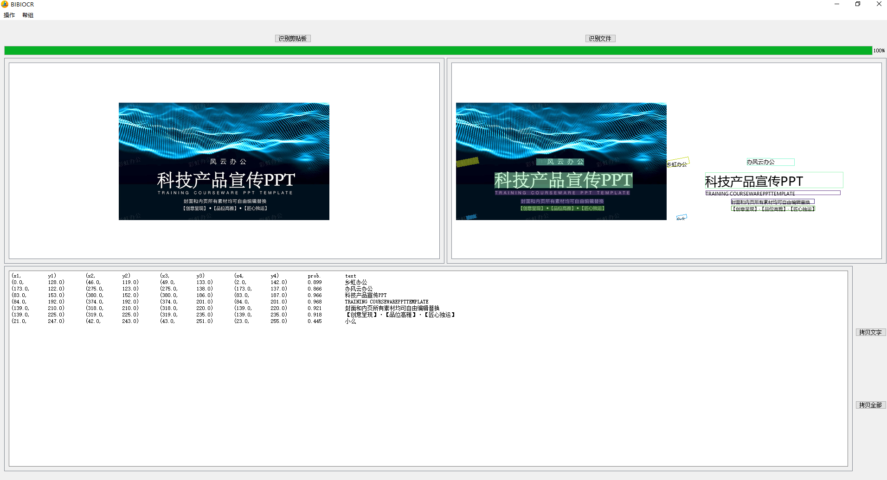

# BibiOcr

BibiOcr is a PyQT5 based windows version offline OCR tool. 

It is very simple and only support one image processing at one time. 

It supports clipboard image processing and copy text to clipboard. 

# Python 3.7 + PyQT5

# 