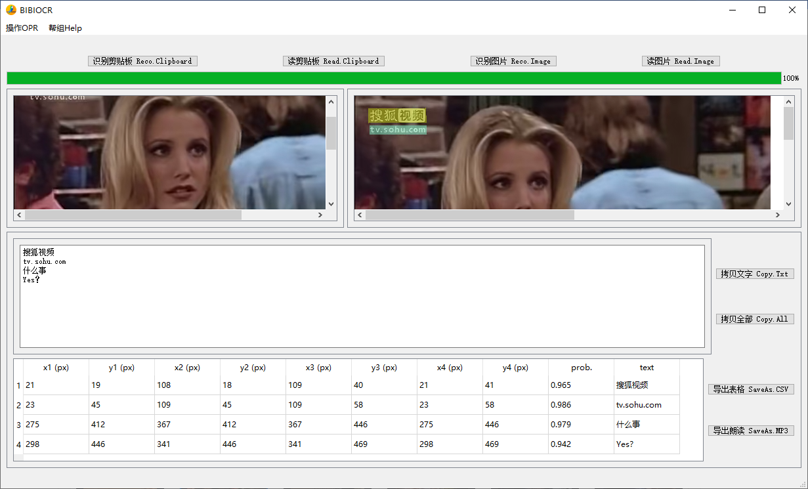

# BibiOcr

BibiOcr is a PyQT5 based windows version offline OCR tool. 

It is very simple and only support one image processing at one time. 

It supports clipboard image processing and copy text to clipboard. 

# Python 3.7 + PyQT5

# edge_tts

zh-CN-XiaomoNeural, zh-CN-XiaoxuanNeural, zh-CN-YunxiNeural, and zh-CN-YunyeNeural

edge-tts --voice zh-CN-XiaomoNeural --text "KIKI猫历险记" --write-media hello.mp3
edge-tts --voice zh-CN-XiaoxuanNeural --text "KIKI猫历险记" --write-media hello.mp3
edge-tts --voice zh-CN-YunxiNeural --text "KIKI猫历险记" --write-media hello.mp3
edge-tts --pitch=-10Hz --rate=0.5  --volume=50 --voice  zh-CN-XiaomoNeural --text "KIKI猫历险记" --write-media hello.mp3

- zh-CN
- zh-CN-XiaoxiaoNeural
- zh-CN-YunyangNeural
- zh-CN-YunyeNeural
- zh-CN-YunxiNeural
- zh-CN-XiaohanNeural
- zh-CN-XiaomoNeural
- zh-CN-XiaoxuanNeural
- zh-CN-XiaoruiNeural
- zh-HK
- zh-HK-HiuMaanNeural
- zh-TW
- zh-TW-HsiaoChenNeural