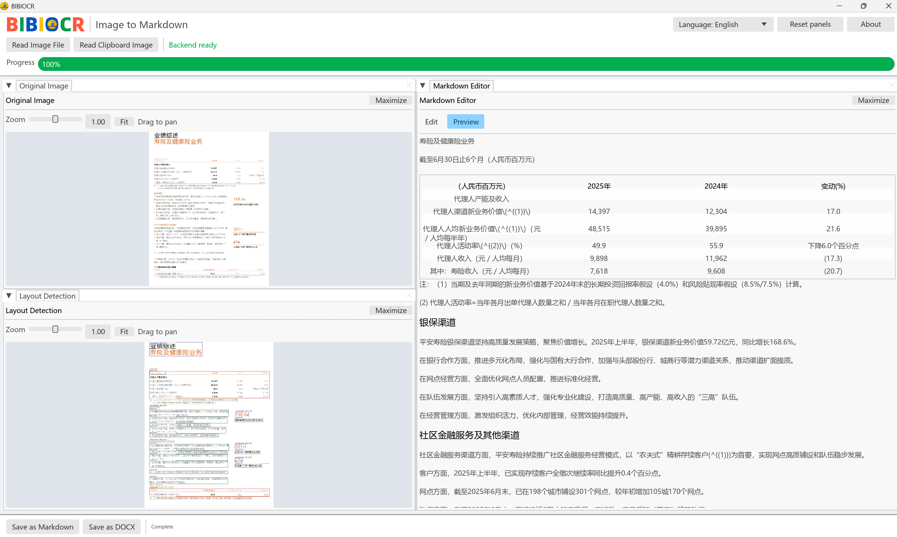

# BIBIOCR means Parrot BIBI can read image with OCR.

BIBIOCR is a RUST based windows version offline OCR tool. 

* It is very simple and only support one image processing at one time. 

* It supports clipboard image processing and copy text to clipboard. 

* It supports export structural  markdown / word of image text.

## UI Demo

## Language Support

- English
- Chinese
- Franch
- Russian
- Korean
- Japanese