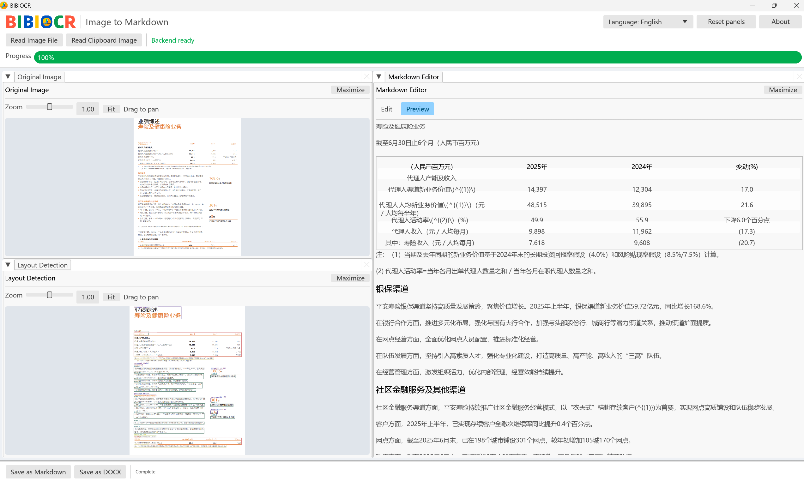
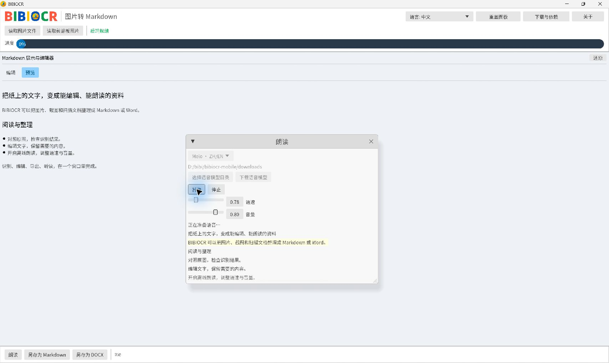
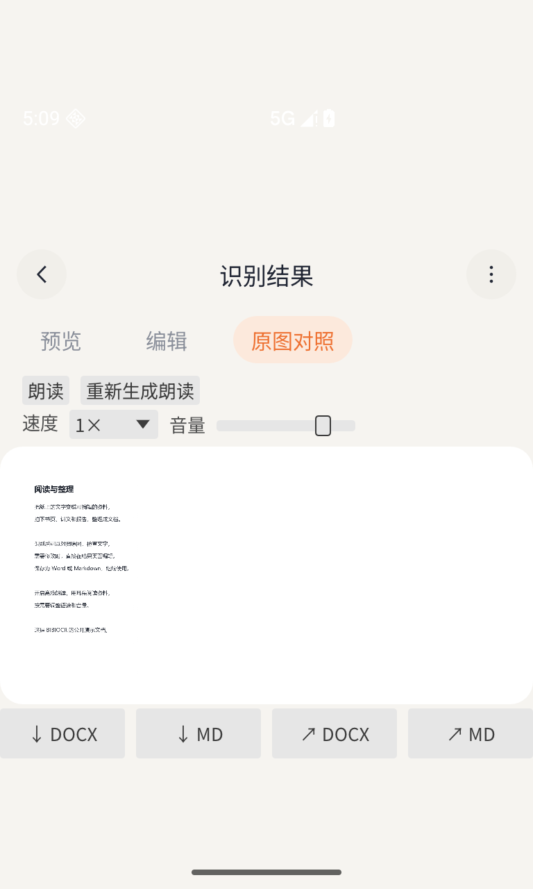

  

<h1 align="center">BIBIOCR · 把图片变成文字，把文字读给你听</h1>

免费开源的离线 OCR 与文档朗读工具，支持 Windows、macOS、Linux 和 Android。

  <a href="https://github.com/bibiparrot/bibiocr/releases/latest"><strong>下载最新版</strong></a> ·
  <a href="desktop/README.md">桌面版使用介绍</a> ·
  <a href="mobile/README.md">Android 使用介绍</a> ·
  <a href="https://github.com/bibiparrot/bibiocr/issues">反馈与建议</a>

截图里的段落、纸质报告里的表格、手机拍下的资料，都可以成为能编辑、能保存、能朗读的文档。BIBIOCR 将识别、原图对照、文字编辑、导出和听读放在一起，让资料整理少一些重复输入。

## 先看看它能做什么

*桌面 OCR 界面示例：对照原图和版面，检查识别出的段落与表格。*

*桌面 2.3.0 实际界面：在文档预览旁开启朗读。截图使用公开演示文字。*

  
  

*Android 0.1.6 在模拟器中的实际界面：公开演示文档的真实识别结果与原图对照，可直接听读、导出或分享。*

## 值得一试的功能

| 功能 | 可以帮你做什么 |
| --- | --- |
| **图片转文字** | 把照片、截图和扫描图片变成可编辑内容，减少手动录入。 |
| **文档结构识别** | 桌面版识别标题、段落、表格等版面内容，整理成 Markdown，方便继续编辑。 |
| **原图对照与编辑** | 一边看原始资料，一边核对文字；修改后直接导出，避免在多个工具之间切换。 |
| **Word 与 Markdown 导出** | 输出 `.docx` 或 `.md`，用于办公文档、学习笔记或知识库。Android 还可直接分享结果。 |
| **离线朗读** | 支持中文与英文听读、句子高亮、语速和音量调整，让整理好的资料也能用耳朵阅读。 |
| **桌面批量处理** | 选择输入、输出文件夹，批量处理图片与扫描 PDF，也可转换支持的办公文档。 |
| **手机拍照与历史记录** | 随手采集纸质资料，保存识别结果；之后通过标题或正文搜索，继续编辑或导出。 |

## 为什么选择 BIBIOCR

- **在自己的设备上识别与朗读。** 模型下载完成后，图片 OCR 和语音合成在本地运行，无需把识别内容上传到云端服务。
- **免费开源，无需账号或云端 API 密钥。** 安装后按界面提示准备模型即可开始使用。
- **从识别到听读，一次完成。** 不只提取文字，也能预览排版、修改结果、导出文件或开启朗读。
- **电脑与手机各有所长。** 桌面适合对照、整理与批量处理；Android 适合拍照采集和随身查阅。
- **下载中断可以接着来。** 提供断点续传、下载进度，以及镜像和代理选项；已下载的模型可继续使用。
- **界面支持多种语言。** 包括中文、英文、日文、韩文、法文、俄文等，可在设置中切换。

### 让文档也能听

整理完资料后，开启朗读即可逐句听读，并跟随高亮查看当前内容。桌面版支持暂停、继续和停止；两端均支持语速、音量调整与语音缓存，重复听读时可以复用已有音频。

中文与英文可选择 **Melo**，英文也可选择 **Kokoro**。调整语速时保留音调；需要重新生成语音时，使用界面中的重新生成按钮。

### 适合这些日常场景

- **学习与阅读：** 将讲义、书页或截图整理成笔记，再开启朗读复习。
- **办公与资料归档：** 将扫描报告、表格和纸质资料转成可编辑文档，集中保存。
- **随手采集：** 在 Android 上拍照识别，回到历史记录里查找、编辑和分享。
- **整理知识库：** 导出 Markdown，继续放入自己的笔记工具或知识库。

## 下载与开始使用

前往 **[GitHub Releases](https://github.com/bibiparrot/bibiocr/releases/latest)**，选择与你的设备匹配的安装包。

| 设备 | 下载选择 |
| --- | --- |
| Windows 64 位 | `windows-x86_64.zip`；完整解压后运行 `bibiocr.exe`。 |
| macOS · Apple Silicon | `arm64-macOS` 安装包。 |
| macOS · Intel | `x86_64-macOS` 安装包。 |
| Linux | 按设备架构选择 x86_64 或 ARM64 的 AppImage、DEB、RPM 或压缩包。 |
| Android | 大多数近年的手机选择 `arm64-v8a.apk`；另提供 `armeabi-v7a`、`x86` 和 `x86_64`。 |

1. **准备模型。** 首次打开时，按下载页面提示准备识别模型；要使用朗读，再准备对应语音模型。此步骤需要联网并预留存储空间。
2. **导入资料。** 桌面读取图片或剪贴板截图；Android 使用拍照或相册导入。
3. **核对并使用结果。** 预览、编辑、导出为 Word／Markdown，或开启离线朗读。

扫描 PDF 与文件夹批量转换请使用桌面版的「批量文件处理」。macOS 当前安装包未经 Apple 公证；Linux 运行需要 GTK、ALSA 和 OpenGL 等系统组件。识别效果取决于图片清晰度与排版，导出前建议对照原图检查。

## 开源与反馈

BIBIOCR 应用代码采用 **[GPL-3.0-only](LICENSE)** 许可证。第三方库、字体、运行时和模型保留各自的许可，详见 [第三方声明](THIRD_PARTY_NOTICES.md)。桌面与 Android 分别位于 [`desktop/`](desktop/) 和 [`mobile/`](mobile/)。

遇到问题或有新想法，欢迎 [提交 Issue](https://github.com/bibiparrot/bibiocr/issues)。如果 BIBIOCR 帮你省下了录入和整理资料的时间，也欢迎点亮 Star，分享给需要它的人。
