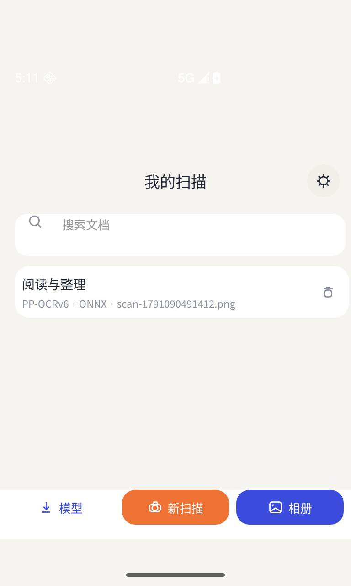
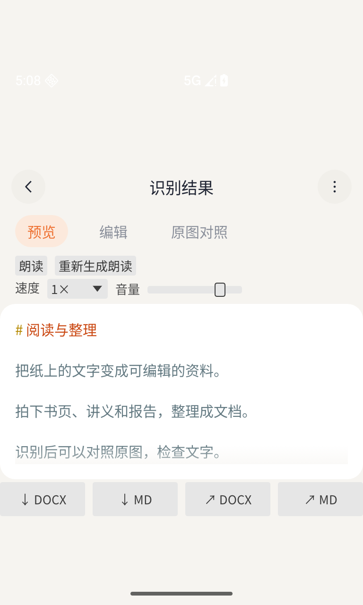
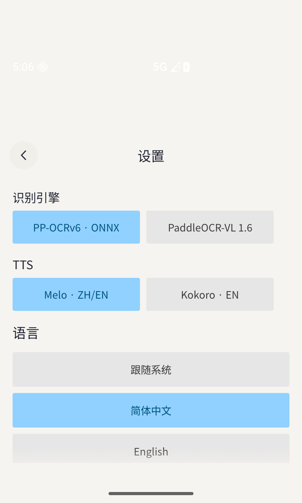

# BIBIOCR Android 版

随手拍下纸质资料，把文字留在手机里。识别、编辑、导出与离线朗读，适合随身采集和阅读。

**[下载 Android APK](https://github.com/bibiparrot/bibiocr/releases/latest)** · [项目首页](../README.md) · [桌面版](../desktop/README.md)

## 软件截图

  
  
  

*Android 0.1.6 在模拟器中的实际界面；识别示例使用公开演示文档。*

## 随身带走这些能力

- **拍照或从相册选图：** 用手机采集书页、讲义、报告和截图，直接开始识别。
- **预览、编辑、原图对照：** 查看识别结果，与原始图片核对，需要时直接修改文字。
- **Word／Markdown 保存与分享：** 导出为 `.docx` 或 `.md`，也可通过 Android 分享交给其他应用。
- **本地历史与搜索：** 识别结果保存在历史记录中，可按标题或正文查找，之后继续编辑、导出或朗读。
- **离线中文与英文朗读：** 支持句子高亮、语速与音量调整，语速变化保留音调；已有音频可复用，也能重新生成。中文／英文可选 Melo，英文也可选 Kokoro。
- **可选择的识别模式：** 默认提供日常文字识别，也可在设置中选择文档识别模式，按需要准备对应模型。
- **多语言界面：** 支持中文、英文、日文、韩文、法文、俄文、西班牙文、德文、意大利文和葡萄牙文。
- **模型下载可继续：** 支持暂停、断点续传和镜像设置，下载完成的模型在后续启动与应用升级时继续使用。

图片识别和语音合成在手机本地运行。模型准备好后可离线使用，无需登录账号或配置云端 API 密钥。

## 开始使用

1. 前往 [发布页](https://github.com/bibiparrot/bibiocr/releases/latest) 下载 APK。多数近年的 Android 手机选择 **`arm64-v8a`**；较旧的 32 位 ARM 设备选择 `armeabi-v7a`，x86 设备或模拟器选择 `x86`／`x86_64`。需要 Android 8.1 或更新版本。
2. 安装并打开应用，按页面提示下载所选识别与朗读模型。首次下载需要联网并预留存储空间。
3. 使用拍照或相册导入图片，识别后对照、编辑，保存或分享结果。需要听读时，在结果页面开启朗读。

识别速度取决于设备性能、图片大小与所选模式。拍摄时尽量保持文字清晰、页面平整、光照均匀；导出前建议核对识别内容。文件夹批量处理和扫描 PDF 转换可使用 [桌面版](../desktop/README.md)。

## 开源与反馈

应用代码采用 [GPL-3.0-only](LICENSE)。第三方材料保留原有许可，见 [第三方声明](../THIRD_PARTY_NOTICES.md)。欢迎通过 [GitHub Issues](https://github.com/bibiparrot/bibiocr/issues) 反馈问题或建议。
